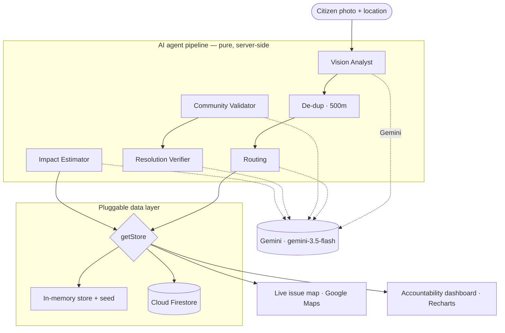

<div align="center">

# 🗺️ LocalVoice2Action

### Every voice. Every street. Every fix.

**A hyperlocal civic-issue platform for Bengaluru. Snap a photo of a problem — a pothole, a water leak, a broken streetlight — and an agentic AI pipeline triages it, de-duplicates it, routes it to the right authority, rallies the neighbourhood, and verifies the fix with before/after vision.**

[](https://localvoice2action-mkeeof7vsq-el.a.run.app)


**🔗 Live app → https://localvoice2action-mkeeof7vsq-el.a.run.app**


</div>

---

## Overview

Civic reporting in most cities is broken at every step of the loop:

- **Fragmented** — complaints are scattered across municipal bodies and helplines. You have to know *which* authority owns *which* problem before you can even report it.
- **Opaque** — once filed, a complaint disappears into a black box. No status, no map, no accountability.
- **Duplicate-heavy** — the same pothole gets reported twenty times. Authorities see noise, not signal.
- **Unvalidated** — a complaint marked "resolved" is taken on faith; nobody checks whether the fix actually held.

The result: people stop reporting, because reporting feels pointless.

**LocalVoice2Action closes the loop.** A single photo becomes an accountable, community-validated, end-to-end resolution:

> **citizen photo → AI triage → de-dup within 500m → route to the right authority → community verification → resolution confirmed by before/after vision → public accountability dashboard**

A report doesn't end at submission — it ends at a vision-verified fix that everyone can see on the map.

---

## Key Features

| | Feature | What it does |
|---|---|---|
| 📸 | **AI photo triage** | Multimodal vision classifies the issue type, severity, and a description from a single photo. |
| 🔍 | **Smart de-duplication** | Geo-matching + Gemini function-calling detect a likely existing report nearby and invite a *confirming* photo — never a cold "rejected, duplicate." |
| 🏛️ | **Auto-routing** | Determines the correct authority and drafts a ready-to-send complaint with the right helpline and priority. |
| 🎚️ | **Before / After slider** | A draggable wipe-comparison on resolved issues — the fix is *seen*, not just claimed. |
| 🤝 | **"You're not alone" card** | Estimates how many neighbours, commuters, and businesses an issue affects — turning a lone complaint into a shared cause. |
| ✅ | **Community verification** | Frictionless, anonymous *Still There / Fixed Now* voting keeps issue status honest. |
| 🏅 | **Gamification** | Anonymous neighbourhood badges and a leaderboard reward civic participation. |
| 🎙️ | **Voice input** | Describe an issue by speaking (Web Speech API, India-English). |
| 📊 | **Accountability dashboard** | Live charts on resolution rates by area and category, plus AI-generated insights for the city. |

---

## How It Works

Every stage of the loop is handled by a dedicated, server-side AI agent. Agents are **pure functions** — no database access inside them; persistence happens only in the API layer.



### The agents

| Agent | Role | Powered by |
|-------|------|------------|
| **Vision Analyst** | Classifies the photo → issue type, severity, confidence, description | Gemini (multimodal vision) |
| **De-dup** | Finds a likely existing report within 500m and decides merge-vs-create | Haversine geo-prefilter + Gemini **function-calling** |
| **Routing** | Maps the issue to the right authority and drafts the complaint | Deterministic authority lookup + Gemini drafting |
| **Community Validator** | Cross-checks a verifier photo against the original report | Gemini (multimodal comparison) |
| **Resolution Verifier** | Compares before/after photos to confirm the fix | Gemini (multimodal comparison) |
| **Impact Estimator** | Estimates who is affected nearby — the collective-impact card | Gemini (reasoning) |

A seventh agent generates the dashboard's **predictive city insights**, cached hourly to stay fast and cost-efficient.

---

## Tech Stack

| Layer | Technology |
|-------|------------|
| **Framework** | Next.js 14 (App Router) · TypeScript (strict) |
| **AI** | Google Gemini (`gemini-3.5-flash`) via the `@google/genai` SDK |
| **Maps** | Google Maps — cost-optimized static-first rendering, interactive on demand |
| **Data** | Pluggable layer: in-memory (default) ↔ Cloud Firestore (drop-in) |
| **UI** | Tailwind CSS · Recharts · framer-motion · lucide-react |
| **Voice** | Web Speech API (browser-native) |
| **Hosting** | Google Cloud Run (containerized, scale-to-zero) |

**Resilient by design:** every AI call is guarded with a timeout and a graceful fallback, each major section is wrapped in an error boundary, and routes have loading skeletons — one slow or failing dependency never takes the page down.

---

## Getting Started

**Prerequisites:** Node 20+ and a Gemini API key from [Google AI Studio](https://aistudio.google.com/).

```bash
# 1. Clone and install
git clone https://github.com/Eternalnik001/localvoice2action.git
cd localvoice2action
npm install

# 2. Configure environment
cp .env.example .env.local
```

Fill in `.env.local`:

```bash
# Required — server-only (no NEXT_PUBLIC_ prefix)
GEMINI_API_KEY=your-gemini-key
GEMINI_MODEL=gemini-3.5-flash

# Required for the interactive map (client-side; restrict by HTTP referrer)
NEXT_PUBLIC_GOOGLE_MAPS_API_KEY=your-maps-key
```

```bash
# 3. Run
npm run dev
```

Open **http://localhost:3000**.

> **No database required.** The app ships with a realistic in-memory dataset, so it runs end-to-end with just a Gemini key. Firestore is an optional drop-in for durable persistence.

---

## Deployment

The app is containerized for **Google Cloud Run** (Next.js standalone output, scale-to-zero).

```bash
gcloud run deploy localvoice2action \
  --source . \
  --region asia-south1 \
  --allow-unauthenticated \
  --set-env-vars GEMINI_API_KEY=your-key,GEMINI_MODEL=gemini-3.5-flash
```

The Google Maps key is a `NEXT_PUBLIC_` value baked in at build time; restrict it by HTTP referrer in the Cloud Console. To enable durable persistence, create a Firestore database and redeploy with `USE_FIRESTORE=1` — the app authenticates with Application Default Credentials, so no service-account key is needed.

---

## Project Structure

```
localvoice2action/
├── app/
│   ├── page.tsx                 # Home — live issue map
│   ├── dashboard/               # Accountability dashboard + AI insights
│   ├── issues/[id]/             # Issue detail — before/after slider, impact card
│   ├── report/                  # Report flow with voice input
│   ├── api/                     # Server route handlers (orchestrate the agents)
│   └── loading.tsx              # Route-level loading skeletons
├── components/                  # UI — slider, cards, charts, map, error boundary
├── lib/
│   ├── agents/                  # Pure AI agent functions (no DB inside)
│   ├── data/                    # Pluggable data layer (in-memory ↔ Firestore) + seed
│   ├── gemini/                  # Gemini client + safe JSON parsing
│   ├── maps/                    # Haversine distance + heatmap weighting
│   └── security/                # Salted IP-hashing for anonymous dedup
├── Dockerfile                   # Multi-stage build for Cloud Run
└── next.config.js
```

---

<div align="center">

Built with Next.js, Google Gemini, and Google Cloud.

**🔗 Google Doc for more info  → https://docs.google.com/document/d/1NEO3K3JfI5ulrTJ5UUhgdD0vg3jXRW2cVVYS-OpgY1s/edit?usp=sharing**


</div>
