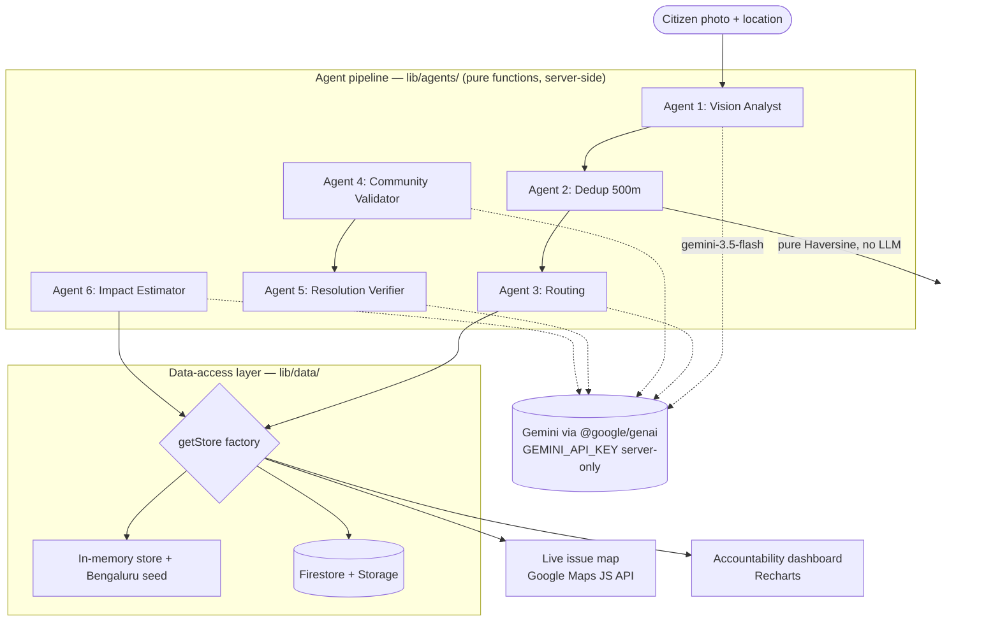
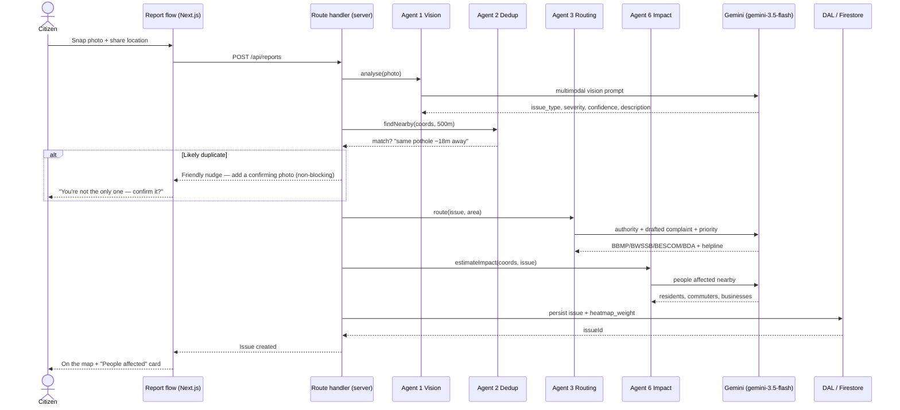

# LocalVoice2Action

### Every voice. Every street. Every fix.

**Hyperlocal civic issue reporting & resolution for Bengaluru — a citizen snaps a photo, and an agentic AI pipeline triages it, de-duplicates it, routes it to the right authority, rallies the neighbourhood, and verifies the fix with before/after vision.**

---

## The Problem

Bengaluru's civic reporting today is broken at every step of the loop:

- **Fragmented.** Complaints are scattered across BBMP Sahaaya, BWSSB, BESCOM, BDA, and a dozen helplines. A citizen has to know *which* authority owns *which* problem before they can even report it.
- **Opaque.** Once a complaint is filed, it disappears into a black box. No status, no accountability, no map of what's broken on your street.
- **Duplicate-heavy.** The same pothole gets reported twenty times by twenty neighbours. Authorities see noise, not signal; citizens feel ignored.
- **Unvalidated.** A complaint marked "resolved" is taken on faith. Nobody checks whether the pothole was actually filled — or just re-tarred a week before it crumbled again.

The result: people stop reporting, because reporting feels pointless.

## The Solution — Closing the Loop

LocalVoice2Action turns a single photo into an accountable, community-validated, end-to-end resolution:

> **citizen photo → AI triage → dedup within 500m → route to authority (BBMP/BWSSB/BESCOM/BDA) → community upvote/verify → resolution verified by before/after vision → public accountability dashboard**

Every stage is handled by a dedicated, server-side AI agent. The loop is *closed*: a report doesn't end at submission, it ends at a vision-verified fix that everyone can see on the map.

---

## Architecture



## Sequence of a Report



---

## The 6-Agent Pipeline

Each agent lives in `lib/agents/` as a **pure function** — no Firestore inside; persistence happens only in route handlers via the DAL.

| Agent | Input | Gemini / Tool | Output |
|-------|-------|---------------|--------|
| **1. Vision Analyst** | Citizen photo | `gemini-3.5-flash` (multimodal vision) | `issue_type`, `severity`, `confidence`, `description`, `requires_immediate_action`, `visual_evidence` |
| **2. Dedup** | New report coords + existing issues | Pure **Haversine** geo-match within 500m (no LLM) | Friendly match — *"same pothole reported ~18m away"* + invite to add a confirming photo (non-blocking) |
| **3. Routing** | Issue type + area | `gemini-3.5-flash` (Phase 2: function-calling) | Correct authority (BBMP/BWSSB/BESCOM/BDA) + drafted complaint + helpline + priority |
| **4. Community Validator** | Verifier photo vs original | `gemini-3.5-flash` (multimodal cross-check) | Confirmation that the verifier photo matches the reported issue |
| **5. Resolution Verifier** | Before/after photos | `gemini-3.5-flash` (multimodal comparison) | `RESOLVED` / `PARTIALLY_RESOLVED` / `NOT_RESOLVED` |
| **6. Impact Estimator** | Issue location + type | `gemini-3.5-flash` (reasoning) | Estimated *people affected* — nearby residents, commuters, businesses, delivery partners → the warm "you're not alone" card |

Agent 6 is a deliberate micro-agent added for **Agentic Depth**: it turns a lone complaint into a visible collective-impact story.

---

## Three Community-Friendly Features

1. **Before & After draggable slider.** A wipe-comparison slider on the issue detail page lets anyone drag between the original and the resolution photo — the fix is *seen*, not just claimed.
2. **Nearby Citizens / "People affected" card.** Powered by Agent 6, this card reframes a solitary report as a shared problem: *"You and ~40 neighbours are affected by this."* You're not alone.
3. **Friendly AI duplicate-detection moment.** When Agent 2 spots a likely match, the report flow never says "duplicate" or "rejected." Instead it warmly invites you to add a confirming photo — non-blocking, always.

Underlying tone: warm human copy, collective impact, frictionless **anonymous participation** (*Still There* / *Fixed Now* with IP-hash dedup), and recognition/belonging (badges, neighbourhood identity).

---

## Tech Stack — and Why

| Choice | Why |
|--------|-----|
| **Next.js 14 (App Router) + TypeScript strict** | One framework for UI + server route handlers; strict TS enforces our "zero `any`" rule. |
| **Tailwind CSS** | Fast, consistent design system (brand blue `#1D4ED8` / amber `#F59E0B` / Inter / severity colors). |
| **`@google/genai` SDK** | **Deliberate correction.** The original spec's `@google/generative-ai` reached EOL on 2025-11-30; `@google/genai` is the unified, supported SDK. |
| **`gemini-3.5-flash` for all agents** | **Deliberate correction.** Gemini 1.x models are shut down and now return HTTP 404. `gemini-3.5-flash` is GA, multimodal, and tuned for agentic / tool-use workloads. |
| **`GEMINI_API_KEY` server-only** | **Deliberate correction.** The spec's `NEXT_PUBLIC_GEMINI_API_KEY` would ship the key in the browser bundle — a leak. The key is read only inside server route handlers. The **Maps** key stays `NEXT_PUBLIC_GOOGLE_MAPS_API_KEY` because the Maps JS API runs client-side. |
| **Firebase (Firestore + Storage + Admin SDK)** | Durable persistence for issues, votes, and photos in production. |
| **Google Maps JS API** | Pins, the issue flashcard, and the heatmap that makes the city's pain visible. |
| **Recharts** | The accountability dashboard (resolution rates, authority response times). |
| **framer-motion** | Smooth, warm micro-interactions (the slider, card reveals). |
| **lucide-react** | Consistent, lightweight iconography. |
| **Google Cloud Run** | Deploy target — containerized, scales to zero, hackathon-friendly. |

---

## Runs Without Firebase

You do **not** need a Firebase project to run or demo this app.

The data-access layer (`lib/data/`) ships a `getStore()` factory that resolves to an **in-memory store** seeded with realistic Bengaluru issues (`lib/data/seed.ts`) when Firebase env vars are absent, and to the **Firestore store** when they're present. Same interface, swapped at runtime.

**Net effect: the full demo runs with just a `GEMINI_API_KEY`** — no Firestore, no Storage, no service account required.

---

## Local Setup

**Prerequisites:** Node 20+, a Gemini API key from Google AI Studio.

```bash
# 1. Configure environment
cp .env.example .env.local
```

Fill in `.env.local`:

```bash
# Required for the agent pipeline (SERVER-ONLY — no NEXT_PUBLIC_ prefix)
GEMINI_API_KEY=your-aistudio-key
GEMINI_MODEL=gemini-3.5-flash

# Required for the map (client-side; restrict by HTTP referrer)
NEXT_PUBLIC_GOOGLE_MAPS_API_KEY=your-maps-key

# Optional — leave blank to run on the in-memory Bengaluru seed
# NEXT_PUBLIC_FIREBASE_* and FIREBASE_ADMIN_* (see .env.example)
```

```bash
# 2. Install and run
npm install
npm run dev
```

Open http://localhost:3000.

---

## Deployment — Google AI Studio + Cloud Run

This project targets the **Google Cloud AI Hackathon** (Gemini via AI Studio, deployed to Cloud Run).

**AI Studio compliance approach.** The hackathon mandates a current, supported Google AI stack, so we proactively corrected three pins from the original spec (documented in `docs/superpowers/specs/2026-06-22-localvoice2action-decisions.md`):

- **Model:** `gemini-3.5-flash` (GA) — Gemini 1.x is shut down and 404s.
- **SDK:** `@google/genai` — the unified, supported SDK; `@google/generative-ai` is EOL.
- **Key handling:** `GEMINI_API_KEY` is server-only; only the Maps key is `NEXT_PUBLIC_`.

**Steps:**

1. Create an API key in **Google AI Studio** and confirm it authenticates against `gemini-3.5-flash`.
2. Build the container (Next.js standalone output) and deploy:

   ```bash
   gcloud run deploy localvoice2action \
     --source . \
     --region asia-south1 \
     --allow-unauthenticated \
     --set-env-vars GEMINI_MODEL=gemini-3.5-flash \
     --set-secrets GEMINI_API_KEY=gemini-api-key:latest
   ```

3. Pass `NEXT_PUBLIC_GOOGLE_MAPS_API_KEY` at build time, and restrict the Maps key by HTTP referrer in the Cloud Console.
4. Firebase env vars are optional — omit them to run Cloud Run on the in-memory Bengaluru seed for a zero-dependency demo.

---

## Scoring-Criteria Mapping

| Criterion | Weight | How LocalVoice2Action scores |
|-----------|--------|------------------------------|
| **Problem / Impact** | 20% | Closes a real, painful Bengaluru loop: fragmented, opaque, duplicate-heavy, unvalidated civic reporting → accountable resolution. |
| **Agentic Depth** | 20% | Six purpose-built agents; Agent 6 (Impact Estimator) + planned Gemini function-calling on Agents 2 & 3 go beyond prompt-chaining. |
| **Innovation** | 20% | Vision-verified resolution (before/after slider), 500m friendly dedup, collective-impact "you're not alone" card, anonymous *Still There / Fixed Now*. |
| **Google Tech** | 15% | `@google/genai` + `gemini-3.5-flash` (multimodal), Google Maps JS API, Firebase, Cloud Run. |
| **Product / Design** | 10% | Warm human copy, brand system, animated micro-interactions, frictionless anonymous participation. |
| **Tech Implementation** | 10% | TS strict / zero `any`, pure agent functions, swappable DAL, server-only secrets, every Gemini call guarded + parsed safely. |
| **Completeness** | 5% | Runs end-to-end with just a Gemini key via the in-memory seed; deployable to Cloud Run. |

---

## Folder Structure

```
LocalVoice2Action/
├── app/
│   ├── globals.css
│   └── layout.tsx
├── lib/
│   ├── agents/                 # Pure agent functions (Phase 2B) — no Firestore inside
│   ├── data/                   # Data-access layer (DAL)
│   │   ├── index.ts            # getStore() factory (memory vs firestore)
│   │   ├── types.ts
│   │   ├── memory-store.ts     # In-memory store
│   │   ├── seed.ts             # Bengaluru seed data
│   │   └── firestore-store.ts  # Firestore-backed store
│   ├── firebase/
│   │   ├── client.ts           # Client SDK (inert until configured)
│   │   └── admin.ts            # Admin SDK
│   ├── gemini/
│   │   ├── client.ts           # generateJson + assertGeminiEnv
│   │   ├── prompts.ts          # Per-agent prompts
│   │   └── utils.ts            # parseGeminiResponse()
│   ├── maps/
│   │   ├── utils.ts            # Haversine distance
│   │   └── heatmap.ts          # heatmap_weight recompute
│   ├── security/
│   │   └── iphash.ts           # IP hashing for confirmation dedup
│   └── types/
│       └── index.ts            # Shared domain types
├── docs/
│   └── superpowers/specs/
│       └── 2026-06-22-localvoice2action-decisions.md
├── .env.example
├── next.config.js
├── tailwind.config.ts
├── tsconfig.json
└── package.json
```
