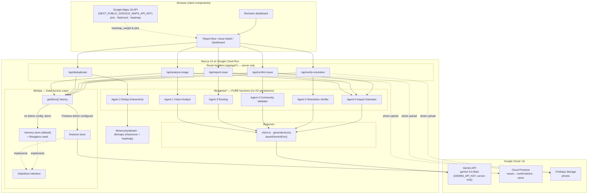
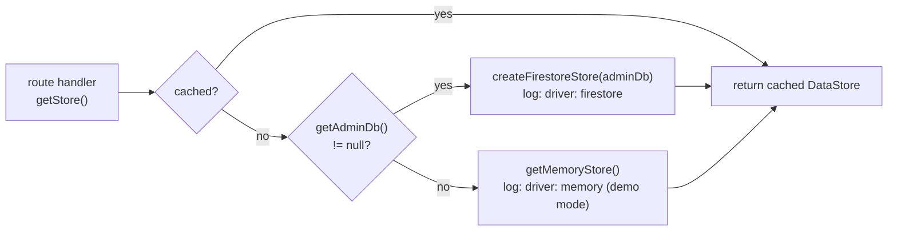
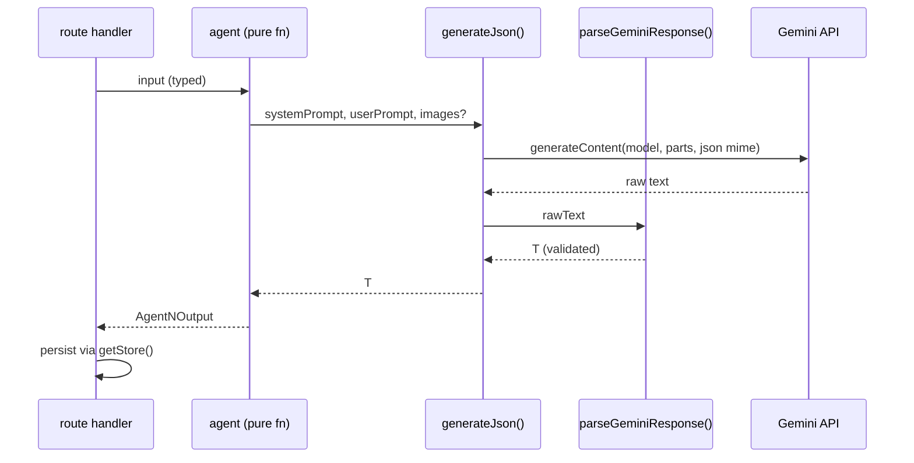
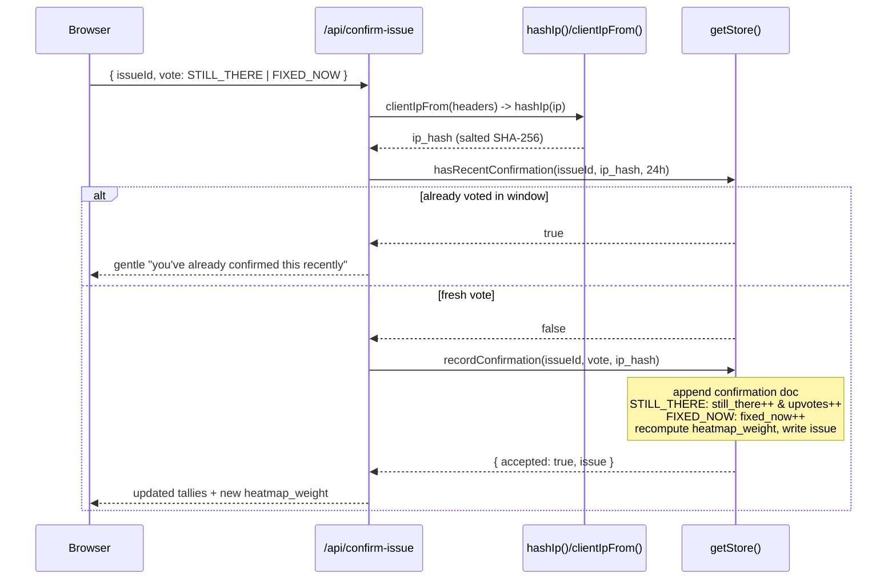
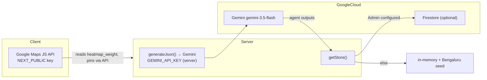

# LocalVoice2Action — Technical Architecture

> Hyperlocal civic issue reporting & resolution for Bengaluru.
> _"Every voice. Every street. Every fix."_

This document is the deep technical reference for engineers working on LocalVoice2Action. It describes the system topology, the data-access layer that lets the app run with **or** without Firebase, the Firestore data model, the agent pipeline, the two principal request lifecycles (report and confirm), the heatmap weighting math, and the security model.

---

## 1. System overview

LocalVoice2Action is a **Next.js 14 (App Router) + TypeScript (strict)** application deployed to **Google Cloud Run**. It has three external Google surfaces and one internal pipeline:

- **Gemini** (`@google/genai`, model `gemini-3.5-flash`) — the six-agent reasoning pipeline. Server-only.
- **Google Maps JS API** — pins, the issue flashcard, and the community-amplified heatmap. Browser-side.
- **Firebase** (Firestore + Storage + Admin SDK) — optional durable persistence. The app runs fully without it via an in-memory driver.

The defining architectural property is the **data-access layer (DAL)**: route handlers and components depend only on a `DataStore` interface obtained through `getStore()`. The concrete driver — in-memory or Firestore — is chosen at runtime based on whether Firebase Admin credentials are present. This makes a Gemini key the only hard requirement to run the full demo.



**Layering rule (enforced):** agents are pure (`lib/agents/*` never touch Firestore); persistence happens **only** in route handlers, and only through `getStore()`. This keeps agents unit-testable and keeps the driver choice invisible to business logic.

---

## 2. The data-access layer (DAL)

### 2.1 Why it exists

The hackathon demo must run with **just a Gemini key** — no Firebase project provisioning, no service account JSON. At the same time, the same code must be able to persist durably to Firestore in a real deployment. The DAL satisfies both: every caller depends on the `DataStore` interface, and a single factory decides which driver backs it.

### 2.2 Driver selection — `getStore()`

`lib/data/index.ts` is the **single switch point**. It is `"server-only"`. It calls `getAdminDb()`; if Firebase Admin is configured it builds the Firestore driver, otherwise it returns the in-memory driver. The result is cached for the process lifetime, and the chosen driver is logged once.



`getAdminDb()` (`lib/firebase/admin.ts`) returns `null` unless all three of `FIREBASE_ADMIN_PROJECT_ID`, `FIREBASE_ADMIN_CLIENT_EMAIL`, and `FIREBASE_ADMIN_PRIVATE_KEY` are set. The private key is stored as a single line with literal `\n` escapes and restored at runtime (`replace(/\\n/g, "\n")`). Because the guard is lazy, importing the data layer never crashes a Firebase-less demo.

### 2.3 The `DataStore` interface

Defined in `lib/data/types.ts`. Both drivers implement it identically, so swapping drivers requires **no** route or component change.

| Method | Purpose |
| --- | --- |
| `listIssues()` | All non-merged issues (`duplicate_of === null`). |
| `getIssue(id)` | One issue or `null`. |
| `createIssue(input)` | Create from `CreateIssueInput`; store assigns id / timestamps / defaults / initial `heatmap_weight`. |
| `updateIssue(id, patch)` | Merge patch, bump `updated_at`, recompute `heatmap_weight`. |
| `findNearbyOpenIssues(lat, lng, issueType, radiusM)` | Open issues of the same type within `radiusM`, sorted nearest-first. Powers dedup. |
| `hasRecentConfirmation(issueId, ipHash, windowMs)` | Has this hashed IP voted on this issue within the window? |
| `recordConfirmation(issueId, vote, ipHash)` | Append a vote, update tallies, recompute `heatmap_weight`. |
| `addConfirmationPhoto(issueId, photoUrl)` | Append a neighbour's confirming photo (the dedup "add my photo" path). |

`CreateIssueInput` carries only the fields a caller supplies (title, description, type, severity, location, photos, authority, reporter, `gemini_confidence`); the store owns `id`, status (`OPEN`), `upvotes`, `verification_status`, timestamps, `confirmations`, and `heatmap_weight`.

`recordConfirmation` returns `RecordConfirmationResult { accepted, reason?, issue }` so callers can distinguish a not-found issue from a recorded vote without throwing.

### 2.4 memory-store vs firestore-store

| Concern | `memory-store.ts` (default) | `firestore-store.ts` |
| --- | --- | --- |
| Backing | Module-scope `Map<string, Issue>` + `Confirmation[]`, stashed on `globalThis` to survive dev hot-reload | Cloud Firestore collections `issues`, `confirmations` |
| Seed | Seeded once from `getSeedIssues()` (Bengaluru data) on construction | None (live data) |
| Geo query | Haversine filter over the Map | `where("issue_type","==",…)` then Haversine read-then-filter |
| Dedup query | Linear scan of `confirmations[]` by `issue_id` + `ip_hash` + cutoff | Composite query `issue_id == · ip_hash == · created_at >= cutoff` `.limit(1)` |
| Durability | Resets on restart / per serverless instance | Durable |
| Timestamps | Native `Date` | `Timestamp` ⇄ `Date` via `toDate()` / `rowToIssue()` |

Both drivers import the **same** `haversineMeters` and `computeHeatmapWeight` helpers — the distance and weight formulas are never duplicated. Both recompute `heatmap_weight` on `createIssue`, `updateIssue`, and `recordConfirmation`.

> Note: the Firestore geo query is read-then-filter, which is fine at demo scale. Production should add geohashing to avoid scanning all issues of a type.

---

## 3. Firestore data model

Three collections. Documents mirror the shared TypeScript types in `lib/types/index.ts`. Dates are stored as Firestore `Timestamp` and normalized back to `Date` on read.

### 3.1 `issues`

| Field | Type | Notes |
| --- | --- | --- |
| `id` | `string` | Firestore doc id (`ref.id`). |
| `title` / `description` | `string` | Human + Agent-1 derived. |
| `issue_type` | `IssueType` | `POTHOLE` · `WATER_LEAKAGE` · `BROKEN_STREETLIGHT` · `GARBAGE_OVERFLOW` · `DAMAGED_FOOTPATH` · `ENCROACHMENT` · `OTHER` · `NOT_A_CIVIC_ISSUE`. |
| `severity` | `Severity` | `LOW` · `MEDIUM` · `HIGH` · `CRITICAL`. |
| `status` | `IssueStatus` | `OPEN` · `ACKNOWLEDGED` · `IN_PROGRESS` · `RESOLVED` · `CLOSED`. Open set = first three. |
| `location` | `GeoLocation` | `{ lat, lng, address, ward, area }`. |
| `photos` | `IssuePhotos` | `{ original, resolution \| null }`. |
| `authority` | `IssueAuthority` | `{ name, department, complaint_text, escalation_days, helpline, priority_flag }`. |
| `reporter_uid` | `string` | May be an anonymous id. |
| `reporter_display_name?` | `string` | Warm attribution ("A neighbour in HSR"). |
| `upvotes` | `number` | Incremented on each `STILL_THERE` vote. |
| `upvoted_by` | `string[]` | UID-level upvote dedup. |
| `verification_status` | `VerificationStatus` | `UNVERIFIED` · `COMMUNITY_VERIFIED` · `DISPUTED`. |
| `gemini_confidence` | `number` | Agent 1 confidence at creation. |
| `created_at` / `updated_at` | `Date`/`Timestamp` | |
| `resolved_at` | `Date \| null` | |
| `resolution_verified` | `boolean` | Set by Agent 5. |
| `resolution_reasoning` | `string \| null` | Agent 5 explanation. |
| `duplicate_of` | `string \| null` | When set, the issue is **merged** and hidden from `listIssues` / `findNearbyOpenIssues`. |
| `confirmations?` | `IssueConfirmations` | `{ still_there, fixed_now, last_updated \| null }`. |
| `heatmap_weight?` | `number` | Pre-computed, community-amplified; rewritten on every mutation. |
| `additional_photos?` | `string[]` | Confirming photos added via the dedup path. |
| `impact_estimate?` | `NearbyCitizens` | Cached Agent 6 estimate (avoids re-billing Gemini per view). |

### 3.2 `confirmations`

One document per anonymous "Still There" / "Fixed Now" vote. **Never stores a raw IP.**

| Field | Type | Notes |
| --- | --- | --- |
| `issue_id` | `string` | Target issue. |
| `vote` | `ConfirmationVote` | `STILL_THERE` \| `FIXED_NOW`. |
| `ip_hash` | `string` | Salted SHA-256 of the client IP. Reversal-resistant. |
| `created_at` | `Date`/`Timestamp` | Used for the 24h dedup window. |

Dedup query indexes on `(issue_id, ip_hash, created_at)`.

### 3.3 `users`

Mirrors `CivicUser`. (Auth/profile is a later phase; the type is the contract.)

| Field | Type | Notes |
| --- | --- | --- |
| `uid` | `string` | |
| `display_name` / `email` / `photo_url` | `string` | |
| `reports_count` / `verifications_count` | `number` | |
| `badge` | `Badge` | `NEWCOMER` · `REPORTER` · `VERIFIED_HERO` · `COMMUNITY_CHAMPION`. |
| `created_at` | `Date`/`Timestamp` | |

---

## 4. Agent pipeline

Six agents live in `lib/agents/*`. Each is a **pure function**: it takes validated input, calls Gemini through `generateJson()`, and returns a typed, validated output. **No agent reads or writes Firestore.** Persistence is the route handler's job.

| Agent | Role | Input → Output |
| --- | --- | --- |
| **1 — Vision Analyst** | Triage a photo | image → `Agent1Output { issue_type, severity, confidence, description, requires_immediate_action, visual_evidence }` |
| **2 — Dedup** | Geo-match within 500m | new report + nearby issues → `Agent2Output { action: MERGE\|CREATE, duplicate_of, matched_issue_id, distance_meters, reasoning }`; surfaced to UI as `DeduplicateResult` / `DuplicateCandidate`. **Pure Haversine, no Gemini.** |
| **3 — Routing** | Pick authority + draft complaint | issue + area → `Agent3Output { authority, department, complaint_text, escalation_threshold_days, helpline, priority_flag }`. Phase 2 adds Gemini function-calling. |
| **4 — Community Validator** | Cross-check verifier photo vs original | photos → `Agent4Output { validation, verification_status, confidence, photos_match, reasoning }` |
| **5 — Resolution Verifier** | Before/after vision | before+after → `Agent5Output { resolution_status: RESOLVED\|PARTIALLY_RESOLVED\|NOT_RESOLVED\|CANNOT_DETERMINE, confidence, reasoning, visible_improvements, remaining_issues }` |
| **6 — Impact Estimator** | "People affected" warm card | issue context → `NearbyCitizens { nearby_residents, commuters, businesses, delivery_partners, reasoning, confidence }` |

### 4.1 Gemini call discipline

Every agent goes through `lib/gemini/client.ts`:

- `generateJson<T>({ systemPrompt, userPrompt, images? })` sets `responseMimeType: "application/json"` and passes the system prompt as `systemInstruction`. Vision agents pass `ImagePart` (`{ mimeType, data }`, base64, no `data:` prefix) appended as `inlineData` parts.
- Model id is `GEMINI_MODEL` env override, default `gemini-3.5-flash`. Gemini 1.5 is shut down and the EOL `@google/generative-ai` SDK is not used.
- Every call is wrapped in try/catch and throws a descriptive `Gemini request failed (model=…): …`. Empty responses throw explicitly.
- Output is **always** parsed via `parseGeminiResponse<T>()` — never raw `JSON.parse`.
- `assertGeminiEnv()` surfaces a clear error if `GEMINI_API_KEY` is missing rather than an opaque SDK throw.



---

## 5. Request lifecycles

### 5.1 Report flow: `analyze-image` → `deduplicate` → `report-issue`

The report flow is three sequential calls. The first two are read-only / advisory; only the third persists. The dedup moment is **non-blocking** — it invites the user to add a confirming photo, never says "duplicate" or "rejected".

```mermaid
sequenceDiagram
  participant U as Browser
  participant AI as /api/analyze-image
  participant DD as /api/deduplicate
  participant RI as /api/report-issue
  participant Ag as Agents 1/2/3/6
  participant DS as getStore()

  U->>AI: photo (base64) + location
  AI->>Ag: Agent 1 (Vision Analyst)
  Ag-->>AI: issue_type, severity, confidence, description
  AI-->>U: Agent1Output

  U->>DD: issue_type + lat/lng
  DD->>DS: findNearbyOpenIssues(lat,lng,type,500)
  DS-->>DD: nearby open issues (nearest-first)
  DD->>Ag: Agent 2 (Haversine match)
  Ag-->>DD: DeduplicateResult (best_candidate, distance)
  DD-->>U: "same pothole reported ~18m away" + invite to add photo

  alt user adds confirming photo
    U->>RI: confirm existing issue + photo
    RI->>DS: addConfirmationPhoto(issueId, url)
  else user files a new report
    U->>RI: confirmed details
    RI->>Ag: Agent 3 (Routing) + Agent 6 (Impact)
    Ag-->>RI: authority + complaint draft; NearbyCitizens
    RI->>DS: createIssue(input)  %% assigns id, status OPEN, heatmap_weight
    DS-->>RI: Issue
  end
  RI-->>U: created/confirmed issue
```

Key points:

- **`findNearbyOpenIssues`** filters to `duplicate_of === null`, matching `issue_type`, status in the open set, within `radiusM` (500m for dedup), sorted by true Haversine distance. The display layer rounds the metres; `haversineMeters` returns the real value.
- **Dedup is advisory.** Choosing to confirm calls `addConfirmationPhoto`; choosing to proceed calls `createIssue`, which the store stamps with `status: OPEN`, zeroed tallies, and an initial `heatmap_weight`.
- **Agent 6** runs at report time and its result is cached on the issue as `impact_estimate` so detail views don't re-bill Gemini.

### 5.2 Confirm flow: `confirm-issue` (IP-hash dedup + heatmap recompute)

Anonymous "Still There" / "Fixed Now" voting. The route hashes the client IP, enforces a one-vote-per-issue-per-24h window, records the vote, and recomputes the heatmap weight.



Key points:

- The dedup window constant `CONFIRMATION_WINDOW_MS = 24 * 60 * 60 * 1000` lives in `lib/data/index.ts`.
- `recordConfirmation` is the only mutating step. It appends a `Confirmation` (with `ip_hash`, never raw IP), bumps the right tally (`STILL_THERE` also increments `upvotes`), sets `last_updated`, and **recomputes and writes `heatmap_weight`** — satisfying the rule that the weight is rewritten on every vote.
- The window check is the route handler's responsibility (`hasRecentConfirmation` then `recordConfirmation`); the store does not enforce it itself.

---

## 6. Heatmap weight formula

`computeHeatmapWeight` in `lib/maps/heatmap.ts` is a pure function. The weight is **community-amplified**: a pothole confirmed 40 times scores far hotter than 40 separate unconfirmed potholes — the same idea as Google Maps traffic weighting.

```
weight = still_there * 2
       + fixed_now   * 0.5
       + severityMultiplier
       + daysUnresolved * 0.5     (daysUnresolved capped at 30)
```

with

```
severityMultiplier = { CRITICAL: 4, HIGH: 3, MEDIUM: 2, LOW: 1 }
daysUnresolved     = clamp( (now - created_at) / 1 day , 0 , 30 )
```

The `still_there` signal dominates (×2), `fixed_now` is a mild damper (×0.5), age adds gradual urgency but saturates at 30 days. Both drivers wrap this via a shared `weightFor(issue)` that falls back to `upvotes` when `confirmations` is absent. It is recomputed and written on `createIssue`, `updateIssue`, and `recordConfirmation`. The Google Maps heatmap layer reads the pre-computed `heatmap_weight` directly, so the browser never runs the formula.

---

## 7. Security model

| Control | Implementation |
| --- | --- |
| **Server-only Gemini key** | `GEMINI_API_KEY` is read only in `lib/gemini/client.ts`. There is **no** `NEXT_PUBLIC_` prefix, so it never enters the browser bundle. `assertGeminiEnv()` fails loudly if missing. |
| **Server-only Firebase Admin** | `lib/firebase/admin.ts` and `lib/data/index.ts` are `"server-only"`. Admin credentials (`FIREBASE_ADMIN_*`) never reach the client; the private key's `\n` escapes are restored server-side at runtime. |
| **IP hashing, never raw IP** | `clientIpFrom(headers)` reads `x-forwarded-for` (first hop) / `x-real-ip`; `hashIp(ip)` returns salted `SHA-256(salt + ":" + ip)` hex. Only the hash is stored in `confirmations.ip_hash`. The salt (`CONFIRMATION_IP_SALT`) is server-side only and is never sent to the client. The hash is deterministic per `(salt, ip)` but not reversible to the IP. |
| **Anonymous, frictionless voting** | Confirmation dedup uses the IP hash + a 24h window — no account, no identifying data held. |
| **No hardcoded secrets** | All secrets come from env. The only fallbacks are non-secret dev conveniences (`lv2a-dev-salt`, `127.0.0.1`) that keep the demo deterministic. |
| **Public maps key** | `NEXT_PUBLIC_GOOGLE_MAPS_API_KEY` is intentionally browser-side (the Maps JS API requires it) and should be restricted by HTTP referrer + API in the Google Cloud console. |

> Auth caveat (from the decisions doc): the supplied Gemini key starts with `AQ.` rather than the usual `AIza…`. If auth fails at runtime, that mismatch is the first thing to check.

---

## 8. How Google Maps, Gemini, and Firebase fit together



- **Gemini** is the brain — six agents, all `gemini-3.5-flash`, all server-side, all routed through one JSON-constrained client. Agent outputs become issue fields persisted by route handlers.
- **Firebase** is the optional durable spine. When `FIREBASE_ADMIN_*` is present, `getStore()` returns the Firestore driver; otherwise the in-memory driver (seeded with Bengaluru data) keeps the full demo working with **only** a Gemini key. Storage holds photos.
- **Google Maps** is the public face — pins, the flashcard, and the heatmap. Crucially, the heatmap consumes the **pre-computed `heatmap_weight`** written server-side on every mutation, so the community-amplified ranking is consistent between map, dashboard, and dedup, and the browser does no scoring.

These three are deliberately decoupled by the DAL and the pure-agent rule: you can demo Maps + Gemini with zero Firebase, then flip to Firestore for durability with no code change beyond setting environment variables.

---

## 9. Notes

- Built on a current, supported Google AI stack: the `@google/genai` SDK with `gemini-3.5-flash`.
